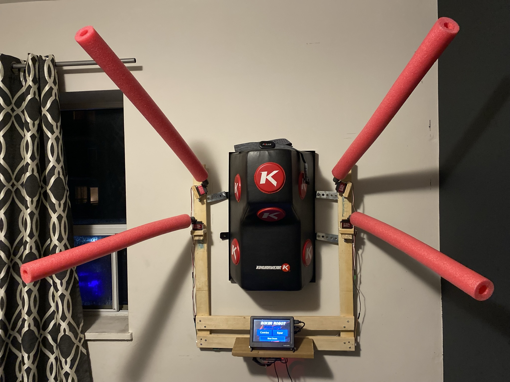

# Custom Boxing Robot
- A custom device designed for a friend that helps improve their boxing skills through simulating real life opponents
- A rpi4 was used to control four servo motors that were attached to pool noodles which "attacked" the user
- Tkinter is used to develop the GUI

https://github.com/garceling/Custom-Boxing-Robot/assets/86638178/0a669148-3d4d-40d1-831c-6690d865f2b2

